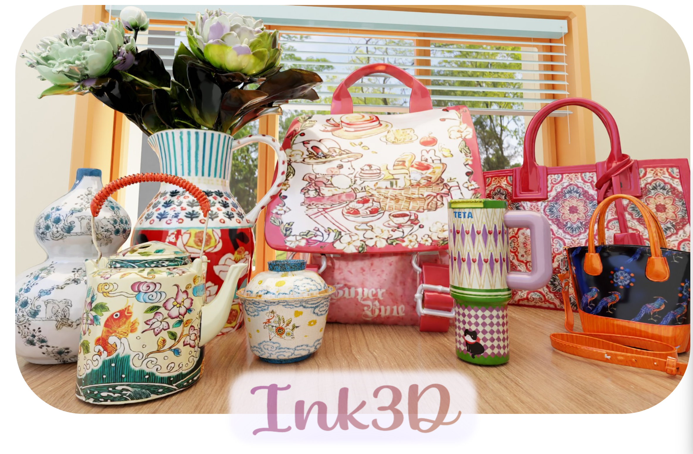

<p align="center">
  
</p>

<h3 align="center">Ink3D: Sculpting 3D Assets with Extremely Complex Textures via Video Generative Models</h3>

<p align="center">
  <a href="#"></a>
  <a href="https://yuehan99.github.io/Ink3D-TextureGen/"></a>
  <a href="LICENSE"></a>
</p>

---

## 📰 News

- **[2026/06/15]** 📦 Example data & pretrained weights available on [Hugging Face](https://huggingface.co/datasets/Yuehavingfun/ink3d-example-data).
- **[2026/06/15]** 🏗️ Dataset preparation: batch GLB rendering to custom camera-trajectory videos (rgb, albedo, normal, position, depth, mask, metalness/roughness) — see [`Render/scripts/batch_render_albedo.py`](Render/scripts/batch_render_albedo.py) and [`batch_render_mr.py`](Render/scripts/batch_render_mr.py).
- **[2026/06/15]** 🔥🔥🔥 Initial release. See [`Render/`](Render/README.md) for condition video rendering, [`OrbitVideoGen/`](OrbitVideoGen/README.md) for video generation training & inference, and [`TextureOptimizer/`](TextureOptimizer/README.md) for texture baking.

---

## Overview

**Ink3D** combines video priors and native 3D priors to generate complex textures with clean boundaries. Given a white mesh and a reference image, it:

1. **Renders** position and normal videos along fixed horizontal and vertical camera orbits
2. **Generates** textured orbital videos with geometry-controlled video generation
3. **Back-projects and repairs** dense video observations in o-voxels, enabling native 3D texture baking with clean boundaries

```
  GLB Mesh  ──→  Render  ──→  Video Gen  ──→  Texture Baking  ──→  .vxz + .glb
    (geometry)     (H/V)        (WAN 14B)        (o-voxel opt.)      (PBR asset)
```

## Quick Start: End-to-End Demo

Walk through the full pipeline. Pre-computed outputs are provided for every step — skip any stage using the provided data.

### Step 0: Environment

```bash
# Render + OrbitVideoGen
conda create -n ink3d python=3.10 -y && conda activate ink3d
pip install torch torchvision torchaudio diffusers accelerate transformers
pip install imageio[ffmpeg] opencv-python-headless scipy numpy Pillow pandas

# TextureOptimizer
conda create -n trellis2 python=3.10 -y && conda activate trellis2
pip install o_voxel numpy opencv-python Pillow imageio trimesh utils3d gco-wrapper

# One-time: Blender & RMBG-2.0
wget https://download.blender.org/release/Blender4.5/blender-4.5.1-linux-x64.tar.xz -P /tmp/
tar -xf /tmp/blender-4.5.1-linux-x64.tar.xz -C /tmp/
export BLENDER_PATH=/tmp/blender-4.5.1-linux-x64/blender
```

### Step 1: Download Example Data

**Pre-rendered condition videos + mesh:**

```bash
pip install huggingface_hub
python3 -c "
from huggingface_hub import snapshot_download
snapshot_download('Yuehavingfun/ink3d-example-data', repo_type='dataset',
                  allow_patterns='034/*', local_dir='./example_data')
"
# Downloads: mesh.glb, h120/, v120/, h_034_ref.mp4, v_034_ref.mp4
```

**Pre-generated textured videos (skip Step 2+3):**

```bash
# All example outputs: spider, cake, bag, panda, etc.
snapshot_download('Yuehavingfun/orbitpainter_example_output', repo_type='dataset',
                  local_dir='./example_output')
# H-only format: h_{case}_G{idx}.mp4 (3072x768, 4-panel, 121 frames)
# HV format:     hv_{case}_G{idx}.mp4 (6144x768, 8-panel, 61 frames, H=panel5 V=panel6)
```

### Step 2: Render Condition Videos

*Skip if using pre-rendered from Step 1.*

```bash
conda create -n bpy40 python=3.10 -y && conda activate bpy40
# bpy 4.0.0: download from Hugging Face (see Render/README.md)
pip install -e Render/

python3 Render/render.py --input_file ./example_data/034/mesh.glb \
    --output_dir ./example_data/034 --model_name 034 \
    --orbit horizontal --num_cameras 120
python3 Render/render.py --input_file ./example_data/034/mesh.glb \
    --output_dir ./example_data/034 --model_name 034 \
    --orbit vertical --num_cameras 120
# Output: example_data/034/h120/*.mp4, v120/*.mp4
```

### Step 3: Generate Textured Videos

*Skip if using pre-generated from Step 1.*

```bash
# Download model weights
pip install huggingface_hub
mkdir -p weights && cd weights
python3 -c "
from huggingface_hub import snapshot_download
snapshot_download('Yuehavingfun/orbitpainter-single', repo_type='model',
                  local_dir='.')
"
cd ..
# Downloads: weights/high_noise.safetensors, weights/low_noise.safetensors
# Base models auto-downloaded on first run (~17GB)

conda activate ink3d
cd OrbitVideoGen && export PYTHONPATH="$(pwd):${PYTHONPATH}"

python tests/test_single_h.py \
    --ref_image ../example_data/034/ref.png \
    --video_dir ../example_data/034/h120 \
    --models_base /path/to/local_models \
    --model_ckpt_high ../weights/high_noise.safetensors \
    --model_ckpt_low ../weights/low_noise.safetensors \
    --output ../example_data/034/h_034_gen.mp4

python tests/test_single_v_hv.py \
    --ref_image ../example_data/034/ref.png \
    --video_dir ../example_data/034/v120 \
    --models_base /path/to/local_models \
    --model_ckpt_high ../weights/high_noise.safetensors \
    --model_ckpt_low ../weights/low_noise.safetensors \
    --output ../example_data/034/v_034_gen.mp4
```

### Step 4: Bake PBR Texture

**H-only video (4-panel, 3072×768):**

```bash
conda activate trellis2
python3 TextureOptimizer/voxelize.py ./example_data/spider/mesh.glb \
    --video ./example_output/h_spider_G001.mp4 \
    --video_num_cols 4 --video_col 2 \
    --mode greedy --resolution 1024 \
    --output_vxz ./output/spider_h.vxz
```

**HV combined video (8-panel, 6144×768, H=panel5, V=panel6):**

```bash
python3 TextureOptimizer/voxelize.py ./example_data/cake/mesh.glb \
    --video ./example_output/hv_cake_G002.mp4 --video_num_cols 8 --video_col 4 \
    --video_v ./example_output/hv_cake_G002.mp4 --video_v_num_cols 8 --video_v_col 5 \
    --mode greedy --resolution 1024 --priority_mode \
    --output_vxz ./output/cake_hv.vxz
```

**Separate H+V videos (4-panel each):**

```bash
python3 TextureOptimizer/voxelize.py ./example_data/034/mesh.glb \
    --video ./example_data/034/h_034_ref.mp4 \
    --video_v ./example_data/034/v_034_ref.mp4 \
    --video_num_cols 4 --video_col 2 --video_v_num_cols 4 --video_v_col 2 \
    --priority_mode --depth_eps 5e-4 \
    --output_vxz ./example_data/034/034.vxz --resolution 1024
# Output: .vxz, .pickle
```

### Step 5: PBR Render

```bash
python3 TextureOptimizer/render_vxz.py \
    --vxz ./example_data/034/034.vxz --mesh ./example_data/034/034.pickle \
    -o ./example_data/034/034_pbr.mp4 \
    --roughness 0.15 --metallic 0.3 --turntable --shaded_only
# Output: 034_pbr.mp4
```

### Step 6: Export GLB

```bash
python3 TextureOptimizer/export_vxz_glb.py \
    --vxz ./example_data/034/034.vxz --mesh ./example_data/034/034.pickle \
    -o ./example_data/034/034.glb \
    --roughness 0.4 --metallic 0.0  # plastic-like: roughness 0.4 (matte), metallic 0.0 (non-metal)
# Tune roughness/metallic:
#   Metal:     --roughness 0.15 --metallic 0.8
#   Plastic:   --roughness 0.4  --metallic 0.0
# Output: 034.glb with baked texture + constant metallic/roughness
```

### Pipeline Checklist

Each step produces specific output files — check they exist before moving on.

| # | Step | What It Does | Input | Expected Output | Check |
|---|------|-------------|-------|-----------------|-------|
| 1 | **Download** | Get example data + weights | — | `example_data/034/`, `weights/` | `ls example_data/034/*.glb weights/*.safetensors` |
| 2 | **Render** | Blender multi-pass rendering | `mesh.glb` | `h120/*.mp4`, `v120/*.mp4` (×6 channels) | `ls h120/albedo.mp4 v120/position.mp4` |
| 3 | **Video Gen** | WAN 14B LoRA inference | `h120/` + `v120/` + `ref.png` + weights | `h_034_gen.mp4`, `v_034_gen.mp4` | `ffprobe h_034_gen.mp4` → 121 frames |
| 4 | **Bake** | Voxelize + graph-cut texturing | `mesh.glb` + generated mp4 | `.vxz`, `.pickle` | check 100% coverage in logs |
| 5 | **PBR Render** | Render baked result as video | `.vxz` + `.pickle` | `_pbr.mp4` | `ffprobe 034_pbr.mp4` |
| 6 | **Export GLB** | UV-unwrap + export textured mesh | `.vxz` + `.pickle` | `.glb` | open in 3D viewer |

**Skipping steps:** pre-rendered videos and pre-generated textures are on HF:
- Step 1+2: `Yuehavingfun/ink3d-example-data` (rendered condition videos)
- Step 3: `Yuehavingfun/orbitpainter_example_output` (pre-generated textured videos)
- Weights: `Yuehavingfun/orbitpainter-single`

## Prepare Your Own Dataset

To render condition videos from your own GLB models, see [`Render/README.md`](Render/README.md#dataset-preparation-batch). The pre-rendered training dataset (~23K Objaverse models, H+V 120-camera renders) is available at [`Yuehavingfun/Objaverse-PBR-render`](https://huggingface.co/datasets/Yuehavingfun/Objaverse-PBR-render).

## Citation

```bibtex
@article{ink3d2026,
  title   = {Ink3D: Sculpting 3D Assets with Extremely Complex Textures via Video Generative Models},
  author  = {},
  journal = {},
  year    = {2026},
}
```

## License

MIT License. See `LICENSE` for details.
